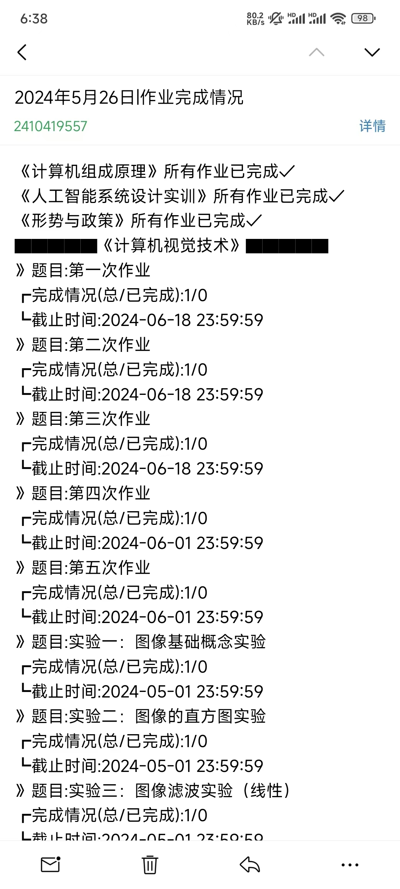

# 简述
本项目旨在通过一个自动化运行的脚本，来替代自己每天登陆和查看雨课堂作业，并通过邮件通知自己作业的完成情况，可以配合定时任务，实现每天定时查询和提醒，避免忘记查看作业导致作业逾期。
# 功能
-[x] 区分已完成作业和未完成作业
-[x] 使用配置文件（config.json）方便设置
-[ ] 提供docker部署
-[ ] 根据作业的截止日期发送提醒邮件
-[ ] 开发web界面，进一步降低使用门槛

# 预览
PC端预览:[查看预览](./img/pc.png)

手机端预览
# 部署
支持以下部署方案
- windows 本机部署
- linux 服务器部署
- 未来将支持docker部署

### 详细部署方案请查阅下方的部署文档
## [部署文档](https://docs.649w.cc/#/private/yuketang)
 
# 声明
本项目由chatgpt生成，仅供研究和学习使用，本人不承担任何责任
# 打赏

